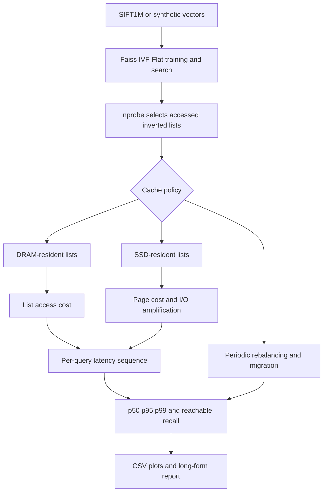

<p align="center">
  
</p>

<p align="center">Figure 1 Project entrance for tiered approximate-nearest-neighbor experiments</p>

<div align="center">
  <h1>Seconds-Rule Tiered ANN</h1>
  <p><strong>Manage Faiss IVF lists across DRAM and SSD, then compare six cache policies by latency, I/O amplification, and migration cost</strong></p>
  <p>
    <a href="README.md">中文</a> ·
    <a href="#architecture-en">Architecture</a> ·
    <a href="#findings-en">Findings</a> ·
    <a href="#quickstart-en">Quick start</a> ·
    <a href="FINAL_REPORT.pdf">76-page report</a>
  </p>
</div>

<p align="center">
  
  
  
  
  
  
  
</p>

> [!IMPORTANT]
> The latency, I/O-amplification, and migration values in this README come from page-level model experiments recorded in the repository's 2025-12-15 report, not from a production SSD, a real server, or an online service
>
> This commit does not contain SIFT1M, the original results directory, or every plot source; the three featured charts were losslessly extracted from the committed PDF, with full context in the [Markdown report](FINAL_REPORT.md) and [PDF report](FINAL_REPORT.pdf)

<a id="overview-en"></a>
## 1 Project overview

The project combines Approximate Nearest Neighbor search, or ANN, with a two-tier storage model in one configurable experiment pipeline
Faiss `IndexIVFFlat` performs vector retrieval, cache policies place each inverted list in Dynamic Random-Access Memory, or DRAM, or on a Solid-State Drive, or SSD, and the simulator then measures query latency, tail latency, SSD pages, I/O amplification, and list-migration cost [1], [2]

<div align="center">

Table 1.1 Project capabilities

| Dimension | Current implementation | Evidence boundary |
| --- | --- | --- |
| Search engine | Faiss `IndexIVFFlat`, L2 distance, `k=10` | `src/ann_engine.py`, `src/groundtruth.py` |
| Cache unit | One IVF inverted list | `src/policies.py` |
| Storage tiers | DRAM list access and SSD page access | `src/latency_model.py` |
| Policies | `all_dram`, `all_ssd`, `lru`, `naive_lfu`, `window_lfu`, `seconds_rule` | Six policy implementations |
| Workloads | Recorded default, fast hotspot, slow hotspot, uniform, and Zipf | Five YAML files and the historical report |
| Sweep axes | DRAM fraction, `nprobe`, maximum IOPS, and random seed | `src/sweeps.py` |
| Outputs | Raw CSV, aggregate CSV, SLA tables, and six plot families | `src/run_all.py`, `src/plotting.py` |
| Current tests | Six passing tests | Policy, latency-model, and IVF-alignment tests |
| Long-form report | One Markdown file and one 76-page PDF | Conclusions, methodology, results, and references |

</div>

The project asks three questions

- How far can limited DRAM reduce the 95th-percentile latency, or p95
- Under which access distributions does Seconds Rule outperform Least Recently Used, or LRU, and Least Frequently Used, or LFU
- How much cache-hit benefit is offset by list-migration volume

<a id="architecture-en"></a>
## 2 Experiment architecture

<div align="center">



Figure 2.1 Tiered ANN experiment data flow

</div>

<div align="center">

Table 2.1 Key stages

| Stage | Input | Output |
| --- | --- | --- |
| Data | SIFT1M 128-dimensional `float32` vectors, or synthetic vectors | Base and query vectors |
| Index | Base vectors and `nlist=64` | IVF-Flat index and list sizes |
| Query | Query vectors and `nprobe` | Candidate list IDs, approximate neighbors, and recall |
| Tiering | List sizes, DRAM fraction, and cache policy | Residency for every list |
| Latency | ANN time, DRAM operations, and SSD pages | Modeled latency for every request |
| Aggregation | Multiple seeds and parameter combinations | Aggregate metrics, SLA tables, and plots |

</div>

<a id="policies-en"></a>
## 3 Cache policies

<div align="center">

Table 3.1 Six policies

| Policy | Residency decision | Useful as | Main cost |
| --- | --- | --- | --- |
| `all_dram` | Every list stays in DRAM | Ideal latency upper bound | Ignores capacity constraints |
| `all_ssd` | Every list stays on SSD | SSD latency lower bound | Maximum page reads |
| `lru` | Retains the most recently used lists | Rapidly changing locality | Can migrate frequently |
| `naive_lfu` | Retains lists with the highest cumulative frequency | Stable hotspots | Reacts slowly to hotspot drift |
| `window_lfu` | Counts frequency only inside a sliding window | Stability-adaptation compromise | Requires window tuning |
| `seconds_rule` | Combines average reuse interval and recency | Hotspots with clear reuse intervals | Migration can reach gigabytes |

</div>

`seconds_rule` updates each list's reuse interval through an exponential moving average and converts `t_star_seconds × assumed_qps_for_tstar` into a query-step threshold
The default configuration uses `alpha=0.1`, recency weight `0.3`, threshold `3.0 s`, and assumed throughput `10,000 QPS`, producing a threshold of 30,000 query steps

<a id="matrix-en"></a>
## 4 Experiment matrix

<div align="center">

Table 4.1 Committed configurations

| Configuration | Base vectors / queries | `nprobe` | DRAM fraction | Maximum IOPS | Requests and seeds |
| --- | ---: | --- | --- | --- | --- |
| `default.yaml` | 20,000 / 2,000 | 1, 4, 16 | 5%, 20% | 1M, 5M | 20,000, one seed |
| `exp_hotspot_fast.yaml` | 100,000 / 1,000 | 1, 2, 4, 8, 16, 32 | 5%, 10%, 20% | 5M | 50,000, three seeds |
| `exp_hotspot_slow.yaml` | 100,000 / 1,000 | 1, 2, 4, 8, 16, 32 | 5%, 10%, 20% | 5M | 50,000, three seeds |
| `exp_uniform.yaml` | 50,000 / 500 | 1, 2, 4, 8, 16, 32 | 5%, 10%, 20% | 5M | 20,000, three seeds |
| `exp_zipf_s1.2.yaml` | 100,000 / 1,000 | 1, 2, 4, 8, 16, 32 | 5%, 10%, 20% | 5M | 20,000, three seeds |

</div>

The fast-hotspot configuration marks 1% of queries as hot, selects them with 90% probability, and rotates the hot set every 2,000 requests
The slow-hotspot configuration uses a 5% hot set, 80% hot-access probability, and a 20,000-request rotation interval
The Zipf configuration uses `s=1.2`, while the uniform configuration cycles query IDs

> [!WARNING]
> `configs/default.yaml` currently declares `workload: default`, while the factory in `src/workload.py` accepts only `uniform`, `random`, `iid`, `zipf`, `zipfian`, `hotspot`, `hotspot_shift`, and `temporal`
>
> The default configuration will raise an unknown-workload error when policy simulation begins; use one of the other four valid configurations for reproduction, or define the intended default semantics in a separate fix

<a id="findings-en"></a>
## 5 Main findings

The following values come from the report's `max_iops=5M`, `nprobe=1` snapshot, where recall is `0.5293` throughout
In the same model, each SSD page costs the `20 μs` base latency plus `1,000,000 / max_iops`, or approximately `20.2 μs` at 5M IOPS

<div align="center">

Table 5.1 Representative results

| Workload and DRAM | Baseline or representative policy | p95 | I/O amplification | Total migration | Observation |
| --- | --- | ---: | ---: | ---: | --- |
| Default, 5% | `all_ssd` | 1,416.22 μs | 35.10 | 0 | SSD page reads dominate the tail |
| Default, 5% | `window_lfu` | 1,274.82 μs | 31.13 | about 24.42 MB | Better balanced than hotspot-chasing policies |
| Fast hotspot, 20% | `seconds_rule` | about 5,090 μs | about 31.57 | about 745 MB | Low I/O amplification requires aggressive movement |
| Fast hotspot, 20% | `lru` | about 5,090 μs | about 30.63 | about 1.72 GB | Lowest I/O with the highest migration |
| Slow hotspot, 20% | `window_lfu` | about 5,610 μs | about 80.13 | about 130 MB | Near Seconds Rule with much less movement |
| Uniform, 20% | `window_lfu` | about 2,760 μs | about 52.32 | about 38.9 MB | Hotspot chasing tends to chase noise |
| Zipf, 5% | `window_lfu` | about 6,730 μs | about 112.74 | about 9.1 MB | Stable long tails favor frequency policies |

</div>

Five conclusions summarize the recorded experiments

- SSD page count nearly determines p95 in the model, so tail latency falls materially only when I/O amplification falls
- Raising `nprobe` improves recall while scanning more lists and increasing both compute and SSD-page cost
- Under rapidly changing hotspots, `seconds_rule` and `lru` reduce more I/O but can migrate hundreds of megabytes or gigabytes
- Under slow hotspots, Zipf, and uniform access, `window_lfu` or `naive_lfu` often reaches similar p95 with much less migration
- For the report's 200 μs and 500 μs service-level objectives, only the all-DRAM baseline has nonzero reachable recall; hybrid policies remain in the millisecond range

These observations describe the current model and parameter range; they do not establish one universally superior production policy

<a id="evidence-en"></a>
## 6 Visual evidence

<p align="center">
  
</p>

<p align="center">Figure 6.1 Default-workload p95 versus DRAM fraction, extracted from the committed PDF</p>

<p align="center">
  
</p>

<p align="center">Figure 6.2 Default-workload I/O amplification versus DRAM fraction, extracted from the committed PDF</p>

<p align="center">
  
</p>

<p align="center">Figure 6.3 Default-workload migration cost versus DRAM fraction, extracted from the committed PDF</p>

Note: the original `results/` directory is not committed, so these images cannot replace raw CSVs and generation logs; see [FINAL_REPORT.md](FINAL_REPORT.md) for their historical interpretation

<a id="model-en"></a>
## 7 Latency and metric model

Page-access time is

$$
t_{page}=ssd\_base\_latency+\frac{10^6}{max\_iops}
$$

Modeled latency for one query is

$$
L(q)=L_{ann}(q)+N_{dram}(q)\cdot t_{dram}+N_{ssd\_pages}(q)\cdot t_{page}
$$

I/O amplification divides SSD bytes read by the bytes required for the useful `top-k` vectors
Migration cost rounds moved bytes up to whole pages and applies the same page cost

<div align="center">

Table 7.1 Metrics

| Metric | Repository computation | How to read it |
| --- | --- | --- |
| `recall@k` | Intersection between approximate and exact top-k results | Higher means more true neighbors were returned |
| p50 / p95 / p99 | Query-latency percentiles | p95 focuses on the slowest 5% of requests |
| `avg_ssd_pages` | Average SSD pages per query | Page count enters the latency model directly |
| `avg_io_amplification` | SSD bytes read / useful top-k bytes | Lower means less wasted reading |
| `total_migration_bytes` | Bytes moved in and, optionally, evicted during rebalancing | Exposes the movement cost behind cache hits |
| `sla_reachable_recall` | Highest recall whose p95 stays within an SLA | Compares retrieval quality inside a latency budget |

</div>

<a id="quickstart-en"></a>
## 8 Quick start

The source uses syntax such as `str | Path`, so Python 3.10 or newer is recommended
This review ran the tests with Python 3.12.7 and Faiss 1.15.0

Step 1, create an isolated environment and install dependencies

```bash
python -m venv .venv                         # Create a repository-local Python environment
source .venv/bin/activate                    # Activate it from Bash or WSL
python -m pip install -r requirements.txt    # Install numerical, plotting, Faiss, and test dependencies
```

Step 2, run the tests that do not require SIFT1M

```bash
python -m pytest -q                          # Run policy, latency-model, and IVF-alignment tests
```

Step 3, place SIFT1M files in the ignored data directory and validate their names

```bash
mkdir -p data/sift1m                         # Create a data directory that Git ignores
bash scripts/get_sift1m.sh data/sift1m       # Validate base and query files without downloading them
```

At minimum, provide `data/sift1m/sift_base.fvecs` and `data/sift1m/sift_query.fvecs`
The official Faiss benchmark describes SIFT1M as a classic dataset with 128 dimensions, one million base vectors, and 10,000 queries, and points to the TexMex Corpus for the data [3]

Step 4, select a currently supported workload configuration

```bash
python -m src.run_all --config configs/exp_uniform.yaml       # Run uniform access and generate CSVs and plots
python -m src.run_all --config configs/exp_zipf_s1.2.yaml     # Run Zipf access and generate CSVs and plots
```

<a id="reproduction-en"></a>
## 9 Reproduction and batch entry points

<div align="center">

Table 9.1 Entry points

| Command | Current behavior | Caveat |
| --- | --- | --- |
| `python -m src.run_all --config …` | Runs one configuration, aggregates, and plots | Recommended direct entry point |
| `bash scripts/run_all.sh …` | Creates `.venv`, installs dependencies, checks data, tests, and runs | Reinstalls dependencies on every run |
| `bash scripts/one_click.sh` | Records environment, tests, experiments, summaries, and a report bundle | Writes local paths into ignored outputs |
| `python scripts/validate_run.py --run_dir …` | Checks one run for output consistency | Requires a real results directory |
| `bash scripts/one_click_report.sh` | Stitches report assets | Requires generated results |

</div>

A complete parameter sweep can take substantial time and memory
Start from a copied configuration with fewer base vectors, queries, seeds, and requests before scaling up

<a id="outputs-en"></a>
## 10 Outputs and reports

<div align="center">

Table 10.1 Runtime artifacts

| Path pattern | Contents |
| --- | --- |
| `results/<run>/raw/ann_policy_raw.csv` | Raw results for every parameter combination and seed |
| `results/<run>/agg/ann_policy_agg.csv` | Means, standard deviations, and 95% confidence intervals |
| `results/<run>/agg/sla_reachable_recall.csv` | Highest reachable recall for each SLA |
| `results/<run>/figures/*.png` | p95, I/O amplification, migration, and recall-latency plots |
| `results/report_bundle_*.json` | Environment and artifact index |
| `report/draft_report_*.md` | Automatically generated report skeleton |

</div>

`data/`, `results/`, and `.venv/` are all excluded by `.gitignore`
The repository retains the long-form report and three charts extracted from the PDF, but not the historical directories described in Table 10.1

<a id="testing-en"></a>
## 11 Test evidence

On 2026-08-24, the tests were rerun in an isolated environment with Python 3.12.7, Faiss 1.15.0, NumPy 2.5.2, Pandas 3.0.5, Matplotlib 3.11.1, PyYAML 6.0.3, and Pytest 9.1.1

<div align="center">

Table 11.1 Current verification results

| Check | Result | Conclusion boundary |
| --- | --- | --- |
| Pytest | 6 passed, 0 failed | Every current test passed |
| Policy budgets | Passed | Naive LFU and LRU initial DRAM counts respect the budget |
| Window LFU | Passed | Windowed access and rebalancing complete without an exception |
| Seconds Rule | Passed | Repeated access updates the average reuse interval |
| Latency model | Passed | Higher IOPS lowers page service time and total latency |
| IVF alignment | Passed | List-ID shape and range are valid |
| Complete SIFT1M pipeline | Not rerun | The workspace has no dataset or historical results directory |
| Historical-report recomputation | Not run | Raw CSVs and a locked dependency snapshot are absent |

</div>

The current tests do not cover complete policy ordering, every plot, SLA tables, or every historical number
A green test run proves basic code-path behavior, not full reproduction of the 76-page report

<a id="structure-en"></a>
## 12 Repository structure

<div align="center">

Table 12.1 Main paths

| Path | Contents |
| --- | --- |
| `src/` | Data loading, IVF engine, policies, latency model, sweeps, aggregation, and plotting |
| `configs/` | Five experiment configurations |
| `tests/` | Three test modules containing six tests |
| `scripts/` | Data checks, batch execution, validation, result export, and report stitching |
| `report tool/` | Repository-inventory and result-summary helpers |
| `FINAL_REPORT.md` | Searchable long-form experiment report |
| `FINAL_REPORT.pdf` | A 76-page formatted report with public identity redacted |
| `docs/assets/readme/` | README banner and three evidence charts |
| `requirements.txt` | Six minimum-version dependency declarations |

</div>

The root and several subdirectories contain historical `tree.txt` snapshots that can mention ignored or removed paths
Use Git-tracked files as the source of truth for current repository contents

<a id="limits-en"></a>
## 13 Limits and interpretation boundaries

- The SSD model is a fixed base page latency plus IOPS service time; it does not simulate queues, concurrency, caches, controllers, or device jitter
- The Faiss index still runs in memory, so SSD residency is a cost model rather than a real block-device data path
- `all_dram` and `all_ssd` are boundary baselines and do not obey the ordinary DRAM budget
- The default report uses historical results whose raw directory is not committed, so a third party cannot currently recompute every row
- Dependencies have minimum versions but no lockfile, so future releases can change performance or plot output
- `configs/default.yaml` uses a workload name that the current factory rejects and needs a separate fix with a regression test
- The 200 μs and 500 μs SLA conclusion applies only to the report's page model and sweep range

<a id="privacy-en"></a>
## 14 Privacy and public release

This revision replaces the personal name on the Markdown and PDF title pages with organization-level attribution while preserving the PDF's 76 pages, body, and charts
See the [README audit](docs/README-AUDIT.md) for the full record

Before publishing new experiments

- Do not commit datasets, query content, raw user vectors, or production access traces
- Do not publish real deployment addresses, server paths, usernames, accounts, tokens, passwords, or license keys
- Environment files and logs generated by `one_click.sh` include a local root path and commit hash, so scan them again before publication
- Use synthetic or redistributable data for plots and state the model and configuration in every title
- Review PDF text, image pixels, metadata, and attachments together for sensitive content

<a id="contributing-en"></a>
## 15 Contributing, license, and references

Separate changes into policy implementation, configuration, tests, and reporting when practical
A policy change should add coverage for budget, rebalancing, migration volume, and workload sensitivity

The project is released under the [Apache License 2.0](LICENSE)

### 15.1 References

[1] Meta Platforms, Inc., “Faiss,” GitHub. [Online]. Available: https://github.com/facebookresearch/faiss

[2] Meta Platforms, Inc., “Faiss indexes,” GitHub Wiki. [Online]. Available: https://github.com/facebookresearch/faiss/wiki/Faiss-indexes

[3] Meta Platforms, Inc., “SIFT1M experiments,” Faiss Benchmarks. [Online]. Available: https://github.com/facebookresearch/faiss/blob/main/benchs/README.md#sift1m-experiments

[4] J. Gray and G. Putzolu, “The 5 minute rule for trading memory for disk accesses and the 10 byte rule for trading memory for CPU time,” in *Proc. ACM SIGMOD*, 1987, pp. 395–398. Available: https://doi.org/10.1145/38713.38755

[5] G. Graefe, “The five-minute rule 20 years later and how flash memory changes the rules,” *Commun. ACM*, vol. 52, no. 7, pp. 48–59, 2009. Available: https://doi.org/10.1145/1538788.1538801

[6] H. Jégou, M. Douze, and C. Schmid, “Product quantization for nearest neighbor search,” *IEEE Trans. Pattern Anal. Mach. Intell.*, vol. 33, no. 1, pp. 117–128, 2011. Available: https://doi.org/10.1109/TPAMI.2010.57

---

<p align="center">
  <strong>Preserve experimental conditions before comparing policy conclusions</strong><br>
  <sub>Model assumptions, raw evidence, and failure boundaries jointly determine whether a result is trustworthy</sub>
</p>
