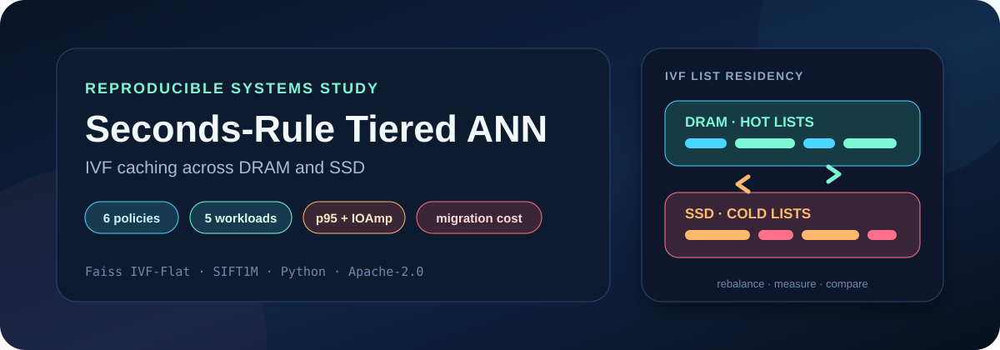
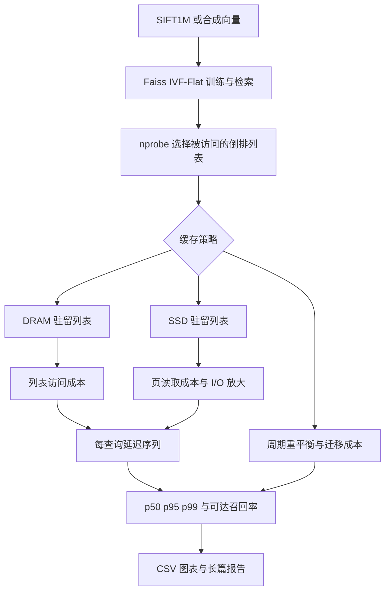
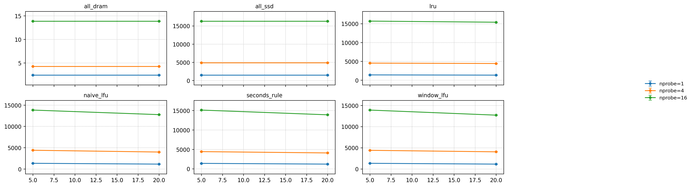
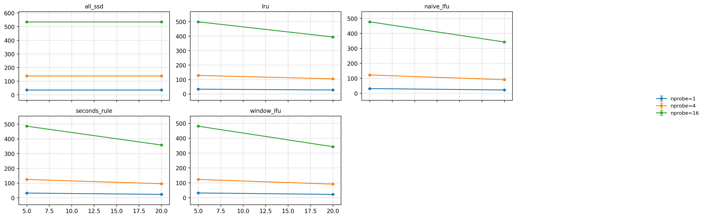
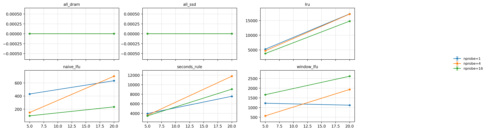

<p align="center">
  
</p>

<p align="center">图 1 分层近似最近邻实验项目入口</p>

<div align="center">
  <h1>Seconds-Rule Tiered ANN</h1>
  <p><strong>在 DRAM 与 SSD 之间管理 Faiss IVF 倒排列表，并比较六种缓存策略的延迟、I/O 放大和迁移成本</strong></p>
  <p>
    <a href="README.en.md">English</a> ·
    <a href="#architecture-cn">实验架构</a> ·
    <a href="#findings-cn">主要发现</a> ·
    <a href="#quickstart-cn">快速开始</a> ·
    <a href="FINAL_REPORT.pdf">76 页报告</a>
  </p>
</div>

<p align="center">
  
  
  
  
  
  
  
</p>

> [!IMPORTANT]
> README 中的延迟、I/O 放大与迁移数值来自仓库内 2025-12-15 报告记录的页级模型实验，不是生产 SSD、真实服务器或在线服务测量值
>
> 当前提交不包含 SIFT1M 数据集、原始结果目录或全部图表源文件，三张展示图从已提交 PDF 中无损提取，完整上下文见 [Markdown 报告](FINAL_REPORT.md) 与 [PDF 报告](FINAL_REPORT.pdf)

<a id="overview-cn"></a>
## 1 项目概览

项目把近似最近邻搜索（Approximate Nearest Neighbor，ANN）与双层存储模型放进同一条可配置实验管线
Faiss `IndexIVFFlat` 负责向量检索
缓存策略决定每个倒排列表驻留在动态随机存取存储器（Dynamic Random-Access Memory，DRAM）还是固态硬盘（Solid-State Drive，SSD）
模拟器再统计查询延迟、尾延迟、SSD 页读取、I/O 放大和列表迁移成本 [1], [2]

<div align="center">

表 1.1 项目能力

| 维度 | 当前实现 | 证据边界 |
| --- | --- | --- |
| 检索引擎 | Faiss `IndexIVFFlat`，L2 距离，`k=10` | `src/ann_engine.py`、`src/groundtruth.py` |
| 缓存单位 | 一个 IVF 倒排列表 | `src/policies.py` |
| 存储层级 | DRAM 列表访问与 SSD 页访问 | `src/latency_model.py` |
| 策略 | `all_dram`、`all_ssd`、`lru`、`naive_lfu`、`window_lfu`、`seconds_rule` | 6 个策略实现 |
| 工作负载 | 默认记录、快速热点、慢速热点、均匀访问、Zipf 长尾 | 5 个 YAML 配置与历史报告 |
| 扫掠维度 | DRAM 比例、`nprobe`、最大 IOPS、随机种子 | `src/sweeps.py` |
| 输出 | 原始 CSV、聚合 CSV、SLA 表、6 类图表 | `src/run_all.py`、`src/plotting.py` |
| 当前测试 | 6 项通过 | 策略、延迟模型与 IVF 对齐测试 |
| 长篇报告 | 1 个 Markdown 与 1 个 76 页 PDF | 结论、方法、结果和参考文献 |

</div>

项目关注三个问题

- 有限 DRAM 能把第 95 百分位延迟（p95）降低到什么程度
- Seconds Rule 在哪些访问分布下优于最近最少使用（Least Recently Used，LRU）和最不经常使用（Least Frequently Used，LFU）
- 缓存命中收益有多少会被列表迁移量抵消

<a id="architecture-cn"></a>
## 2 实验架构

<div align="center">



图 2.1 分层 ANN 实验数据流

</div>

<div align="center">

表 2.1 关键阶段

| 阶段 | 输入 | 输出 |
| --- | --- | --- |
| 数据 | SIFT1M 的 128 维 `float32` 向量，或合成向量 | 基础向量与查询向量 |
| 索引 | 基础向量、`nlist=64` | IVF-Flat 索引与列表大小 |
| 查询 | 查询向量、`nprobe` | 候选列表编号、近似邻居、召回率 |
| 分层 | 列表大小、DRAM 比例、缓存策略 | 每个列表的驻留位置 |
| 延迟 | ANN 计算时间、DRAM 操作数、SSD 页数 | 每条请求的模型延迟 |
| 汇总 | 多个种子和参数组合 | 聚合指标、SLA 表与图表 |

</div>

<a id="policies-cn"></a>
## 3 缓存策略

<div align="center">

表 3.1 六种策略

| 策略 | 驻留决策 | 适合用作 | 主要代价 |
| --- | --- | --- | --- |
| `all_dram` | 全部列表在 DRAM | 理想延迟上界 | 忽略容量约束 |
| `all_ssd` | 全部列表在 SSD | SSD 延迟下界 | 最大页读取量 |
| `lru` | 优先保留最近访问列表 | 快速变化的局部性 | 可能频繁迁移 |
| `naive_lfu` | 优先保留累计高频列表 | 稳定热点 | 对热点漂移响应较慢 |
| `window_lfu` | 只统计滑动窗口内频率 | 稳定性与适应性的折中 | 窗口大小需要调参 |
| `seconds_rule` | 结合平均复用间隔与最近访问 | 复用间隔明显的热点 | 迁移量可能达到 GB 级 |

</div>

`seconds_rule` 使用指数移动平均更新列表复用间隔，并把 `t_star_seconds × assumed_qps_for_tstar` 转换成查询步数阈值
默认配置使用 `alpha=0.1`、最近性权重 `0.3`、阈值 `3.0 s`、假设吞吐量 `10,000 QPS`，因此阈值为 30,000 个查询步

<a id="matrix-cn"></a>
## 4 实验矩阵

<div align="center">

表 4.1 已提交配置

| 配置 | 基础向量 / 查询 | `nprobe` | DRAM 比例 | 最大 IOPS | 请求与种子 |
| --- | ---: | --- | --- | --- | --- |
| `default.yaml` | 20,000 / 2,000 | 1、4、16 | 5%、20% | 1M、5M | 20,000，1 个种子 |
| `exp_hotspot_fast.yaml` | 100,000 / 1,000 | 1、2、4、8、16、32 | 5%、10%、20% | 5M | 50,000，3 个种子 |
| `exp_hotspot_slow.yaml` | 100,000 / 1,000 | 1、2、4、8、16、32 | 5%、10%、20% | 5M | 50,000，3 个种子 |
| `exp_uniform.yaml` | 50,000 / 500 | 1、2、4、8、16、32 | 5%、10%、20% | 5M | 20,000，3 个种子 |
| `exp_zipf_s1.2.yaml` | 100,000 / 1,000 | 1、2、4、8、16、32 | 5%、10%、20% | 5M | 20,000，3 个种子 |

</div>

快速热点配置把 1% 查询设为热点，并以 90% 概率访问它们，每 2,000 次请求更换热点集合
慢速热点配置使用 5% 热点、80% 热点访问概率和 20,000 次请求的更换间隔
Zipf 配置使用 `s=1.2`，均匀配置按查询编号循环复用请求

> [!WARNING]
> `configs/default.yaml` 当前写入 `workload: default`，但 `src/workload.py` 的工厂只接受 `uniform`、`random`、`iid`、`zipf`、`zipfian`、`hotspot`、`hotspot_shift` 和 `temporal`
>
> 默认配置在进入策略模拟时会触发未知工作负载错误，复现实验时应先使用其余四个有效配置，或在独立修复中明确默认工作负载语义

<a id="findings-cn"></a>
## 5 主要发现

以下数值来自报告中的 `max_iops=5M`、`nprobe=1` 快照，召回率均为 `0.5293`
同一模型下，SSD 每页成本为 20 微秒基础延迟加 IOPS 服务时间
在 5M IOPS 时，服务时间是 `1,000,000 ÷ 5,000,000 = 0.2` 微秒，与基础延迟相加得到 20.2 微秒

<div align="center">

表 5.1 代表性结果

| 工作负载与 DRAM | 对照或代表策略 | p95（微秒） | I/O 放大 | 总迁移量 | 观察 |
| --- | --- | ---: | ---: | ---: | --- |
| 默认，5% | `all_ssd` | 1,416.22 | 35.10 | 0 | SSD 页读取主导尾延迟 |
| 默认，5% | `window_lfu` | 1,274.82 | 31.13 | 约 24.42 MB | 比热点追逐策略更均衡 |
| 快速热点，20% | `seconds_rule` | 约 5,090 | 约 31.57 | 约 745 MB | 低 I/O 放大来自激进迁移 |
| 快速热点，20% | `lru` | 约 5,090 | 约 30.63 | 约 1.72 GB | I/O 最低但迁移最高 |
| 慢速热点，20% | `window_lfu` | 约 5,610 | 约 80.13 | 约 130 MB | 接近 Seconds Rule，迁移显著更低 |
| 均匀，20% | `window_lfu` | 约 2,760 | 约 52.32 | 约 38.9 MB | 热点追逐容易变成追逐噪声 |
| Zipf，5% | `window_lfu` | 约 6,730 | 约 112.74 | 约 9.1 MB | 稳定长尾适合频率策略 |

</div>

结论可以归纳为五点

- SSD 页读取数几乎决定模型中的 p95，降低 I/O 放大才会明显降低尾延迟
- `nprobe` 增大可以提高召回率，也会扫描更多列表并同步增加计算与 SSD 页成本
- 快速变化热点下，`seconds_rule` 和 `lru` 能降低更多 I/O，但迁移可达到数百 MB 或 GB
- 慢速热点、Zipf 和均匀访问下，`window_lfu` 或 `naive_lfu` 往往以更小迁移获得接近的 p95
- 在报告的 200 微秒与 500 微秒服务等级目标下，只有全 DRAM 基线得到非零可达召回率，混合策略仍停留在毫秒级

这些观察反映当前模型和参数空间，不表示某个策略在所有生产环境中始终更优

<a id="evidence-cn"></a>
## 6 图表证据

<p align="center">
  
</p>

<p align="center">图 6.1 默认工作负载的 p95 与 DRAM 比例，摘自已提交 PDF</p>

<p align="center">
  
</p>

<p align="center">图 6.2 默认工作负载的 I/O 放大与 DRAM 比例，摘自已提交 PDF</p>

<p align="center">
  
</p>

<p align="center">图 6.3 默认工作负载的迁移成本与 DRAM 比例，摘自已提交 PDF</p>

注：原始 `results/` 目录没有纳入 Git，以上图片不能替代原始 CSV 和生成日志，完整历史解释见 [FINAL_REPORT.md](FINAL_REPORT.md)

<a id="model-cn"></a>
## 7 延迟指标模型

页访问时间写成

$$
t_{page}=ssd\_base\_latency+\frac{10^6}{max\_iops}
$$

单条查询的模型延迟写成

$$
L(q)=L_{ann}(q)+N_{dram}(q)\cdot t_{dram}+N_{ssd\_pages}(q)\cdot t_{page}
$$

I/O 放大使用 SSD 读取字节数除以真正需要的 `top-k` 向量字节数
迁移成本把移动字节向上取整为页数，再乘以相同页成本

<div align="center">

表 7.1 指标含义

| 指标 | 仓库计算方式 | 阅读方式 |
| --- | --- | --- |
| `recall@k` | 近似结果与精确 top-k 的交集比例 | 越高代表返回更多真实近邻 |
| p50 / p95 / p99 | 查询延迟分位数 | p95 关注较慢的 5% 请求 |
| `avg_ssd_pages` | 每查询访问的平均 SSD 页数 | 页数直接进入延迟模型 |
| `avg_io_amplification` | SSD 读取字节 / 有效 top-k 字节 | 越低代表无效读取越少 |
| `total_migration_bytes` | 重平衡期间移入和可选移出的字节总量 | 揭示缓存命中的搬运代价 |
| `sla_reachable_recall` | p95 不超过 SLA 时的最大召回率 | 比较延迟预算内的检索质量 |

</div>

<a id="quickstart-cn"></a>
## 8 快速开始

Python 源码使用 `str | Path` 等语法，建议使用 Python 3.10 或更新版本
本轮在 Python 3.12.7 与 Faiss 1.15.0 上完成测试

1. 第一步，创建隔离环境并安装依赖

```bash
python -m venv .venv                         # 在仓库内创建 Python 虚拟环境
source .venv/bin/activate                    # 在 Bash 或 WSL 中激活虚拟环境
python -m pip install -r requirements.txt    # 安装数值计算、绘图、Faiss 与测试依赖
```

2. 第二步，运行不依赖 SIFT1M 的测试

```bash
python -m pytest -q                          # 运行策略、延迟模型与 IVF 对齐测试
```

3. 第三步，把 SIFT1M 文件放入忽略目录并检查文件名

```bash
mkdir -p data/sift1m                         # 创建不会进入 Git 的数据目录
bash scripts/get_sift1m.sh data/sift1m       # 只验证 base 与 query 文件，不执行下载
```

所需文件至少包括 `data/sift1m/sift_base.fvecs` 和 `data/sift1m/sift_query.fvecs`
Faiss 官方基准把 SIFT1M 描述为 128 维、100 万基础向量和 1 万查询的经典数据集，并指向 TexMex Corpus 获取数据 [3]

4. 第四步，选择当前受支持的工作负载配置

```bash
python -m src.run_all --config configs/exp_uniform.yaml       # 运行均匀访问实验并生成 CSV 与图表
python -m src.run_all --config configs/exp_zipf_s1.2.yaml     # 运行 Zipf 长尾实验并生成 CSV 与图表
```

<a id="reproduction-cn"></a>
## 9 实验复现流程

<div align="center">

表 9.1 入口脚本

| 命令 | 当前行为 | 注意事项 |
| --- | --- | --- |
| `python -m src.run_all --config …` | 运行单个配置、聚合并绘图 | 推荐的直接入口 |
| `bash scripts/run_all.sh …` | 创建 `.venv`、安装依赖、检查数据、测试并运行 | 每次都会执行依赖安装 |
| `bash scripts/one_click.sh` | 记录环境、测试、实验、汇总和报告包 | 会把本地路径写入忽略目录 |
| `python scripts/validate_run.py --run_dir …` | 检查单次运行产物一致性 | 需要真实结果目录 |
| `bash scripts/one_click_report.sh` | 拼接报告素材 | 依赖已经生成的结果 |

</div>

一次完整参数扫掠可能消耗较长时间和较多内存
先复制配置并减少基础向量数、查询数、种子数和请求数，再扩大实验规模

<a id="outputs-cn"></a>
## 10 运行产物说明

<div align="center">

表 10.1 运行产物

| 路径模式 | 内容 |
| --- | --- |
| `results/<run>/raw/ann_policy_raw.csv` | 每个参数组合与种子的原始结果 |
| `results/<run>/agg/ann_policy_agg.csv` | 均值、标准差与 95% 置信区间 |
| `results/<run>/agg/sla_reachable_recall.csv` | 每个 SLA 下可达到的最大召回率 |
| `results/<run>/figures/*.png` | p95、I/O 放大、迁移与召回延迟图 |
| `results/report_bundle_*.json` | 环境与产物索引 |
| `report/draft_report_*.md` | 自动生成的报告骨架 |

</div>

`data/`、`results/` 和 `.venv/` 都被 `.gitignore` 排除
当前仓库只保留长篇报告和从 PDF 提取的三张展示图，不包含表 10.1 中的历史原始目录

<a id="testing-cn"></a>
## 11 测试证据

2026-08-24 在隔离环境使用 Python 3.12.7、Faiss 1.15.0、NumPy 2.5.2、Pandas 3.0.5、Matplotlib 3.11.1、PyYAML 6.0.3 和 Pytest 9.1.1 复跑测试

<div align="center">

表 11.1 本轮验证结果

| 检查 | 结果 | 结论边界 |
| --- | --- | --- |
| Pytest | 6 通过、0 失败 | 当前全部测试通过 |
| 策略预算 | 通过 | Naive LFU 与 LRU 初始 DRAM 数量符合预算 |
| Window LFU | 通过 | 滑动窗口访问和重平衡不抛出异常 |
| Seconds Rule | 通过 | 重复访问会更新平均复用间隔 |
| 延迟模型 | 通过 | 更高 IOPS 会降低页服务与总延迟 |
| IVF 对齐 | 通过 | 列表编号形状和范围正确 |
| 完整 SIFT1M 管线 | 未复跑 | 当前工作区没有数据集和历史结果目录 |
| 历史报告复算 | 未执行 | 缺少原始 CSV 与锁定依赖快照 |

</div>

现有测试没有覆盖全部策略排序、完整图表生成、SLA 表和每个历史数值
测试成功证明代码路径的基础行为，不等同于复现 76 页报告的全部结论

<a id="structure-cn"></a>
## 12 仓库结构

<div align="center">

表 12.1 主要路径

| 路径 | 内容 |
| --- | --- |
| `src/` | 数据加载、IVF 引擎、策略、延迟模型、扫掠、聚合与绘图 |
| `configs/` | 5 个实验配置 |
| `tests/` | 3 个测试模块，合计 6 项测试 |
| `scripts/` | 数据检查、批处理、校验、结果导出与报告拼接 |
| `report tool/` | 仓库清单与结果摘要辅助工具 |
| `FINAL_REPORT.md` | 可搜索的长篇实验报告 |
| `FINAL_REPORT.pdf` | 76 页排版报告，已完成公开身份脱敏 |
| `docs/assets/readme/` | README 横幅和 3 张报告证据图 |
| `requirements.txt` | 6 个最低版本依赖声明 |

</div>

根目录与多个子目录中的 `tree.txt` 是历史清单快照，可能包含已经忽略或删除的路径
判断当前仓库内容时应以 Git 跟踪文件为准

<a id="limits-cn"></a>
## 13 结论适用边界

- 模型把 SSD 成本简化为固定基础页延迟加 IOPS 服务时间，没有模拟队列、并发、缓存、控制器和设备抖动
- Faiss 索引仍在内存中执行，SSD 驻留是成本模型，不是实际块设备数据路径
- `all_dram` 与 `all_ssd` 是上下界基线，不受普通 DRAM 预算约束
- 默认报告结论使用历史结果，而原始结果目录没有提交，第三方目前无法逐行复算
- 依赖只声明最低版本，没有锁文件，未来版本可能改变性能或绘图结果
- `configs/default.yaml` 的工作负载名称与当前工厂不匹配，需要单独修复并补回归测试
- 200 微秒与 500 微秒 SLA 结论只适用于报告中的页延迟模型和扫掠范围

<a id="privacy-cn"></a>
## 14 公开发布安全

本轮把 Markdown 与 PDF 首页的个人姓名统一替换为组织级署名，PDF 页数、正文和图表保持不变
完整记录见 [README 审计](docs/README-AUDIT.md)

公开新实验前执行以下检查

- 不提交数据集、查询内容、原始用户向量或生产访问轨迹
- 不提交真实部署地址、服务器路径、用户名、账号、令牌、密码和许可证密钥
- `one_click.sh` 生成的环境文件和日志含本地根路径与提交摘要，公开前必须重新扫描
- 图表只使用合成数据或允许公开的数据集，并在标题中写明模型与配置
- 对 PDF 文本、图片像素、文档元数据和附件统一做脱敏复核

<a id="contributing-cn"></a>
## 15 项目协作规范

建议把变更拆成策略实现、配置、测试和报告四类提交
策略变更至少补充预算、重平衡、迁移量和工作负载敏感性测试

项目依据 [Apache License 2.0](LICENSE) 发布

### 15.1 引用

[1] Meta Platforms, Inc., “Faiss,” GitHub. [Online]. Available: https://github.com/facebookresearch/faiss

[2] Meta Platforms, Inc., “Faiss indexes,” GitHub Wiki. [Online]. Available: https://github.com/facebookresearch/faiss/wiki/Faiss-indexes

[3] Meta Platforms, Inc., “SIFT1M experiments,” Faiss Benchmarks. [Online]. Available: https://github.com/facebookresearch/faiss/blob/main/benchs/README.md#sift1m-experiments

[4] J. Gray and G. Putzolu, “The 5 minute rule for trading memory for disk accesses and the 10 byte rule for trading memory for CPU time,” in *Proc. ACM SIGMOD*, 1987, pp. 395–398. Available: https://doi.org/10.1145/38713.38755

[5] G. Graefe, “The five-minute rule 20 years later and how flash memory changes the rules,” *Commun. ACM*, vol. 52, no. 7, pp. 48–59, 2009. Available: https://doi.org/10.1145/1538788.1538801

[6] H. Jégou, M. Douze, and C. Schmid, “Product quantization for nearest neighbor search,” *IEEE Trans. Pattern Anal. Mach. Intell.*, vol. 33, no. 1, pp. 117–128, 2011. Available: https://doi.org/10.1109/TPAMI.2010.57

---

<p align="center">
  <strong>先保留实验条件，再比较策略结论</strong><br>
  <sub>模型假设、原始证据和失败边界共同决定结果是否可信</sub>
</p>
